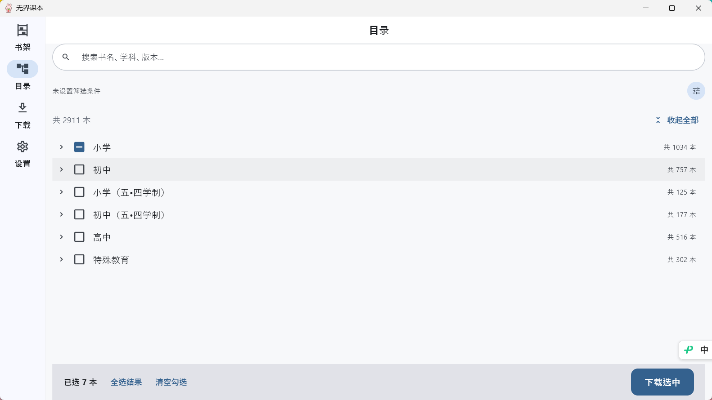
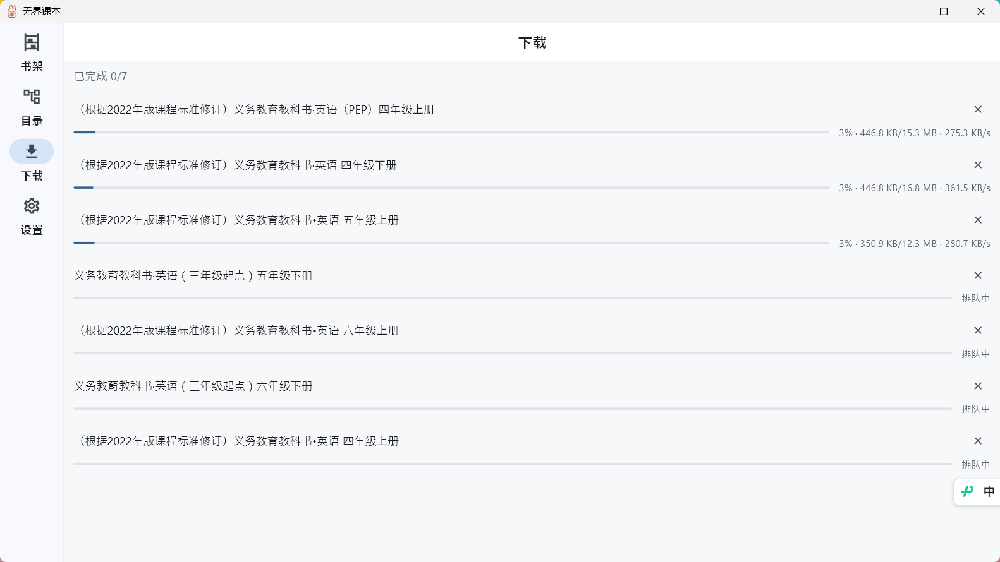

# 无界课本

国家中小学智慧教育平台（basic.smartedu.cn）的第三方客户端，Windows + Android 双端。
支持浏览、搜索、筛选、批量下载与离线阅读平台上的电子教材。

> 本应用与国家中小学智慧教育平台没有隶属或合作关系。教材版权归原平台及相关权利人所有，
> 仅供个人学习与教学参考，请勿用于商业用途或二次分发。





## 功能

| 模块 | 能力 |
| --- | --- |
| 目录 | 2911 本教材的分类树（学段 → 学科 → 版本 → 年级 → 册次），按维度筛选、关键词搜索 |
| 选择 | 树级三态复选框，可整类勾选；勾选与筛选解耦，可跨条件分次勾选后一起下载 |
| 详情 | 页数、体积、出版社、分类路径；没有源文件的条目明确提示"暂不提供在线阅读" |
| 登录 | 内嵌平台官方登录页，用**用户自己的账号**登录；凭据只进系统安全存储 |
| 下载 | 并发 3 + 间隔 200ms 限流，镜像轮换，断流退避，`.part` 原子落盘，失败可单独重试 |
| 阅读 | 内置 PDF 阅读器，记录并恢复阅读进度 |
| 书架 | 只展示已下载到本地的教材，可导出到任意位置 |
| 离线 | 目录数据增量缓存，已下载的教材完全离线可读 |

## 技术选型

选型原则是优先使用 pub.dev 上下载量与点赞数最高、且仍在积极维护的库。

| 领域 | 选型 | 说明 |
| --- | --- | --- |
| 路由 | [go_router](https://pub.dev/packages/go_router) | Flutter 官方维护的声明式路由 |
| 状态管理 | [provider](https://pub.dev/packages/provider) | `ChangeNotifier` + `InheritedWidget`，无额外框架抽象 |
| 网络 | [dio](https://pub.dev/packages/dio) | 拦截器与适配器体系完整 |
| 屏幕适配 | [flutter_screenutil](https://pub.dev/packages/flutter_screenutil) | 按设计稿等比换算宽高、圆角与字号 |
| 本地存储 | [shared_preferences](https://pub.dev/packages/shared_preferences) | 缓存持久层与普通设置 |
| 安全存储 | [flutter_secure_storage](https://pub.dev/packages/flutter_secure_storage) | 令牌等敏感数据 |
| 图片缓存 | [cached_network_image](https://pub.dev/packages/cached_network_image) | 内存 + 磁盘两级图片缓存 |
| 连通性 | [connectivity_plus](https://pub.dev/packages/connectivity_plus) | 驱动离线态展示 |
| 日志 | [logger](https://pub.dev/packages/logger) | 替代 `print`，按环境分级 |
| 日期 | [intl](https://pub.dev/packages/intl) | 日期与时长的本地化格式化 |
| 值语义 | [equatable](https://pub.dev/packages/equatable) | 实体与策略对象的相等性判断 |
| 代码生成 | [json_serializable](https://pub.dev/packages/json_serializable) | JSON 序列化 |

## 平台接口

平台接口随时可能变（参考项目的历史 issue 显示平均每年要跟进几次）。
**所有域名、路径、请求头、限流参数都收敛在 [lib/values/nd_config.dart](lib/values/nd_config.dart)**，
接口变动时只需要改这一个文件。

几个实测得来、容易踩错的事实：

- **清单里的 `ti_items` 是空数组**，文件地址必须逐本请求详情才能拿到；
- **`module_version` 与内容更新无关**（实测停在 2023 而内容更新到 2026），
  缓存失效一律用分片 ETag；
- **标签树是 DAG 不是树**（185 个 tag_id 里 101 个重复出现），节点身份必须用路径；
- **标签树的分层是 `分组 → 节点 → 分组 → 节点` 交替的**，把分组当节点读会静默挂不上任何书；
- **私有 CDN 的 HEAD 返回 200 但 GET 返回 401**，任何探测都必须用 GET；
- **私有域必须带 `X-ND-AUTH` 签名**，且签名按 URL 现算、不能跨 URL 复用。

## 目录结构

```
lib/
├── apis/            接口层：有哪些接口、返回什么类型
├── entity/          实体层：纯数据模型，不依赖 Flutter
├── pages/           页面层：一个页面一个目录
├── providers/       状态层：跨页面共享的状态
├── services/        服务层：日志、存储、缓存、网络、路由、连通性
├── utils/           工具层：Result / Failure / 扩展方法
├── values/          常量层：配置、颜色、尺寸、文案、主题、存储键
├── widgets/         组件层：无业务语义的通用组件
└── main.dart        入口：创建依赖容器并注入 widget 树
```

**依赖方向是单向的**，不允许出现反向 import：

```
apis/ ──▶ services/ ──▶ utils/ ──▶ values/
providers/ ──▶ apis/ + services/
pages/ + widgets/ ──▶ providers/ + values/
```

唯一的例外是 `services/app_dependencies.dart`。它是**组合根（Composition Root）**，
必须认识所有层才能把它们装配起来。整个应用只有这一个文件可以"什么都 import"。

### 分层约定

- **不使用 MVVM**。页面直接消费 `Provider`，不引入 ViewModel 层。
- 页面私有状态放在 `pages/<功能>/<功能>_provider.dart`，
  只有跨页面共享的状态才放进 `providers/`。
- 每个目录都有同名 barrel 文件（如 `values/values.dart`），
  外部统一从 barrel 导入，内部文件调整不影响调用方。

## 缓存设计

缓存是本骨架中投入最多设计的部分，位于 `services/cache/`。整体由四个可独立替换的
角色拼装而成：

```
CacheManager          门面：按业务语义读写，屏蔽全部细节
  ├── CachePolicy           决策：读谁、写谁、存多久
  ├── CacheCodec            编解码：值 ↔ 字符串
  └── CacheStore            存储契约
        ├── MemoryCacheStore        一级：进程内 LRU
        ├── PreferencesCacheStore   二级：落盘持久化
        └── TieredCacheStore        组合：多级串联 + 回填
```

### 五种缓存策略

| 策略 | 行为 | 适用场景 |
| --- | --- | --- |
| `networkOnly` | 不读不写缓存 | 登录、支付 |
| `cacheOnly` | 只读缓存，未命中即失败 | 已下载的课程内容 |
| `cacheFirst` | 缓存新鲜就用缓存 | 低频变更的教材目录 |
| `networkFirst` | 先网络，失败回落缓存 | 需要时效但也要能离线看 |
| `staleWhileRevalidate` | 立即返回旧数据 + 后台刷新 | 首页、信息流 |

### 关键设计决策

- **缓存失败永不打断业务**。`CacheStore` 的实现内部消化异常并降级，
  缓存坏掉最多让应用变慢，不会让功能不可用。
- **`read` 返回过期条目**。新鲜度判断交给 `CacheManager`，
  因为离线兜底和 `staleWhileRevalidate` 恰恰需要读到过期数据。
- **持久化缓存按 LRU 淘汰**，并有独立的保留期清理，不会无限增长。
- **写操作不参与缓存**。只有 `GET` 会被缓存，
  `POST` 的重复提交问题应当用幂等键解决，而不是缓存。
- **ETag / Last-Modified 条件请求**：命中 `304` 时复用本地数据，
  只延长有效期，省掉一次响应体传输。
- **缓存键携带身份标识**，避免切换账号后读到上一位用户的数据。

### 给接口配置缓存策略

优先级：请求级显式指定 > 路径规则注册表 > 默认不缓存。

```dart
// 方式一：单个请求显式指定
dio.get(
  '/textbooks',
  options: Options(extra: <String, dynamic>{
    CacheRequestKeys.policy: CachePolicy.longLived,
  }),
);

// 方式二：在 CachePolicyRegistry 上按路径注册（推荐，集中声明）
registry
  ..registerPrefix('/api/v1/textbooks/', CachePolicy.longLived)
  ..registerPrefix('/api/v1/textbooks', CachePolicy.standard);
```

默认策略刻意设为 `CachePolicy.none`：新增接口默认不缓存，
需要缓存必须显式声明，避免"某个接口悄悄被缓存了"这类意外。

## 错误处理

请求结果统一用 `Result<T>` 表达，不抛异常：

```dart
final Result<List<Textbook>> result = await api.get(
  '/textbooks',
  decoder: ApiClient.envelope<List<Textbook>>(Textbook.listFromJson),
);

switch (result) {
  case Success(:final data):
    render(data);
  case Failure(:final failure):
    showError(failure.message);
}
```

`AppFailure` 是 `sealed` 的，`switch` 会做穷尽检查——新增失败类型时，
所有未处理的分支会在编译期报错。UI 层可以直接用
`AppErrorView.fromFailure(failure, onRetry: ...)`，
它会按 `isRetryable` 自动决定要不要给重试按钮（4xx 与解析失败不给，
因为重试多少次结果都一样）。

## 屏幕适配

设计稿尺寸在 `values/app_config.dart` 的 `AppConfig.designSize` 中声明（当前 `360 × 690`），
必须与 UI 稿一致，它是所有换算的基准。

业务代码中**不写裸数字**，统一取自 `values/app_dimens.dart`：

```dart
// 不推荐
SizedBox(height: 16)

// 推荐
SizedBox(height: AppDimens.gapMd)
```

`AppDimens` 内部已经按语义选好了换算方式：
`.w` 用于宽度与水平间距，`.h` 用于需要"一屏高度固定"的场景，
`.r` 用于圆角与正方形边长，`.sp` 用于字号。需要临时换算时可直接用扩展方法
（`16.w` / `16.r` / `16.sp`）。

## 已知环境问题

以下问题都已在仓库中修复，此处记录原因，避免后来者再次踩坑。

### Windows 构建：C4819 编码错误

Flutter 的 Windows 模板对所有目标（含插件）启用了 `/WX`（警告视为错误）。
MSVC 默认按系统本地代码页读取源文件，在中文 Windows（代码页 936）下，
插件源码中的 UTF-8 字符会触发 C4819 并直接导致构建失败。

修复：在 `windows/CMakeLists.txt` 的 `APPLY_STANDARD_SETTINGS` 中加上 `/utf-8`。

### Android 构建：Kotlin 增量缓存报错

在 Windows 上编译含 Kotlin 源码的插件时，会随机出现
`Could not close incremental caches` / `Storage ... is already registered`
导致构建失败，清理 `build/` 与重启 Gradle 守护进程都无法稳定修复。

修复：在 `android/gradle.properties` 中设置 `kotlin.incremental=false`。
代价是插件模块的 Kotlin 编译不再增量，对构建耗时影响很小。

### Windows 构建：插件需要 NuGet

`flutter_inappwebview_windows` 在构建时用 NuGet 拉取 WebView2、WIL、nlohmann.json 三个包。
系统没装 NuGet 时，报错是一串难以理解的 `MSB3073 / NUGET-NOTFOUND`（退出码 9009）。

修复：把 `nuget.exe` 放进 `windows/tools/`，并在 `windows/CMakeLists.txt` 中把它加进
`CMAKE_PROGRAM_PATH`——这样不需要改动开发者的系统 PATH。缺失时 CMake 会给出明确的获取命令。

### Windows 构建：`<experimental/coroutine>` 被 MSVC 判为错误

`flutter_inappwebview_windows` 使用了 `<experimental/coroutine>` 与 `/await`。
MSVC 14.51（VS 2026 / v180 工具集）已将其从弃用警告升级为硬错误 C2338。

修复：在 `windows/CMakeLists.txt` 中定义
`_SILENCE_EXPERIMENTAL_COROUTINE_DEPRECATION_WARNINGS`（这是微软提供的过渡开关）。
待该插件迁移到 C++20 `<coroutine>` 后即可删除。

### PDFium 下载受网络影响（构建失败时先看这条）

`pdfrx` 通过 `pdfium_dart` 的构建钩子在**构建时**从 GitHub Release 下载 PDFium（4~7MB）。
该下载走 `release-assets.githubusercontent.com`，在部分网络环境下会间歇性失败，
报错形如 `Failed to download PDFium: HTTP 404 ...chromium%2F7811/pdfium-win-x64.tgz`。

> **注意**：这个 404 具有误导性。经核实 `chromium/7811` 这个 Release 与它的
> `pdfium-win-x64.tgz` 资产**一直存在**，是网络链路（代理/加速器）把失败包装成了 404，
> 并非上游删了版本。遇到时不要急着降级 pdfrx，先确认网络。

修复：`dart run tool/setup_pdfium.dart` 预置二进制。钩子内部有
`if (await output.exists()) return;`，文件已存在就不会再发起那次网络请求。
